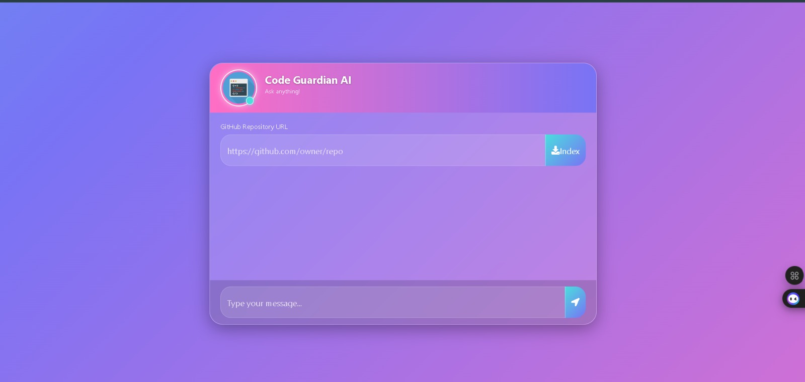

# 🛡️ CodeGuardian AI

> **AI-powered GitHub Repository Code Analysis Assistant** built with Retrieval-Augmented Generation (RAG) that understands source code and answers natural language questions about any GitHub repository.

---

## 📌 Overview

CodeGuardian AI allows users to analyze public GitHub repositories simply by providing the repository URL.

The application automatically:

- 📥 Clones the repository
- 📂 Parses source code and project files
- ✂️ Splits code into semantic chunks
- 🧠 Generates vector embeddings
- 🗃️ Stores embeddings in ChromaDB
- 💬 Answers repository-specific questions using Retrieval-Augmented Generation (RAG)

Instead of manually reading hundreds of files, users can ask questions in natural language and receive contextual answers grounded in the repository.

---

# 📸 Project Demo


<p align="center">

</p>

---

# ✨ Features

- 🔍 Analyze any public GitHub repository
- 🤖 AI-powered repository question answering
- 🧠 Retrieval-Augmented Generation (RAG)
- 📑 Intelligent document chunking
- 📦 Automatic repository cloning
- 💾 Vector database using ChromaDB
- 🔎 Semantic search over repository code
- 📄 Supports multiple programming and project file formats
- ⚡ Fast local embeddings using Sentence Transformers
- 🌐 Clean Flask web interface

---

# 📂 Supported File Types

| Category | Extensions |
|-----------|------------|
| Python | `.py` |
| JavaScript | `.js`, `.jsx` |
| TypeScript | `.ts`, `.tsx` |
| Web | `.html`, `.css` |
| Documentation | `.md`, `.txt` |
| Configuration | `.json`, `.yaml`, `.yml`, `.toml`, `.xml` |
| Programming | `.java`, `.cpp`, `.c`, `.h`, `.go`, `.rs`, `.php` |
| Database | `.sql` |

---

# 🛠️ Tech Stack

| Category | Technologies |
|----------|--------------|
| **Language** | Python |
| **Backend** | Flask |
| **Frontend** | HTML, CSS, JavaScript |
| **AI Framework** | LangChain |
| **Embeddings** | Sentence Transformers (`all-MiniLM-L6-v2`) |
| **Vector Database** | ChromaDB |
| **Repository Loader** | GitPython |
| **Code Parsing** | LangChain GenericLoader, LanguageParser |
| **Document Splitting** | RecursiveCharacterTextSplitter |
| **Version Control** | Git & GitHub |

---

# ⚙️ System Workflow

```text
GitHub Repository URL
          │
          ▼
 Clone Repository
          │
          ▼
 Parse Source Files
          │
          ▼
 Split Into Chunks
          │
          ▼
 Generate Embeddings
          │
          ▼
 Store in ChromaDB
          │
          ▼
 Retrieve Relevant Chunks
          │
          ▼
 Generate AI Response
```

---

# 📁 Project Structure

```text
CodeGuardian-AI
│
├── app.py
├── store_index.py
├── helper.py
├── requirements.txt
├── templates/
├── static/
├── db_store/
├── repo/
└── README.md
```

---

# 🚀 Installation

```bash
git clone https://github.com/<username>/CodeGuardian-AI.git

cd CodeGuardian-AI

pip install -r requirements.txt

python app.py
```

Open

```
http://127.0.0.1:8080
```

---

# 💡 Example Questions

- Explain the architecture of this repository.
- What technologies are used?
- Describe the folder structure.
- Which file is the application entry point?
- Explain how authentication works.
- Summarize this repository.
- Where is the API implemented?
- Which files are responsible for the UI?
- Explain the database flow.

---

# 🎯 Applications

- Repository onboarding
- Codebase exploration
- Developer documentation assistant
- Open-source project understanding
- AI-assisted code navigation
- Software engineering interviews

---

# 📈 Future Improvements

- 📊 Time Complexity Analysis
- 📊 Space Complexity Analysis
- 🔍 Algorithm Detection
- ⚠️ Code Smell Detection
- 🧪 Test Case Generation
- 📝 Automatic Documentation
- 🌍 Multi-language Code Understanding

---

# 👩‍💻 Author

**Malempati Gnapika**

B.E. Computer Science Engineering Student

---

